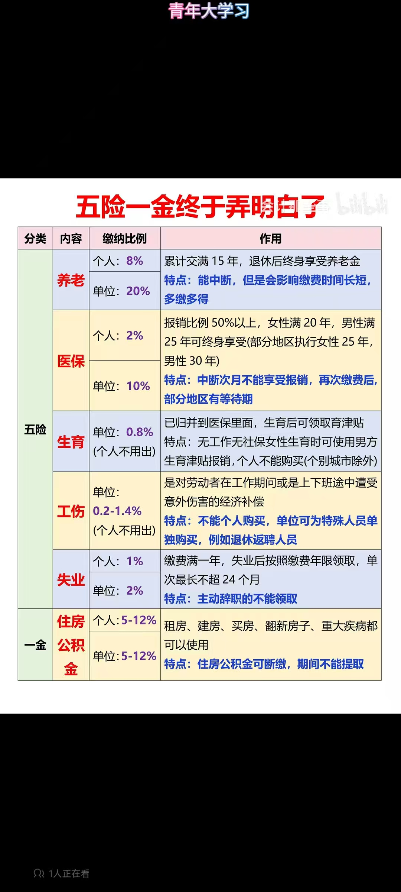
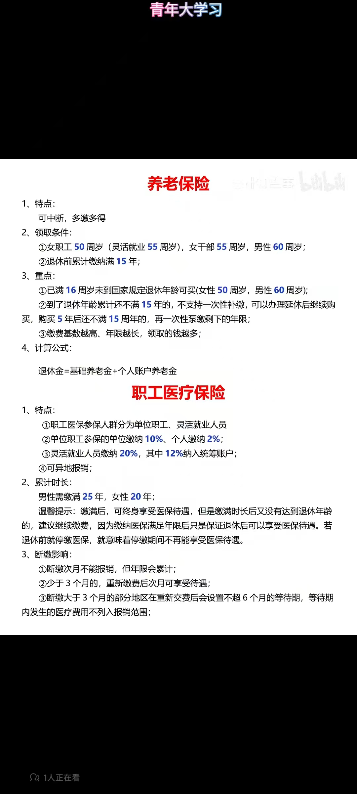
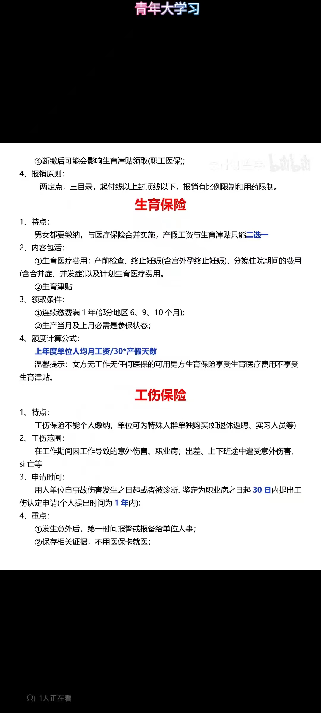
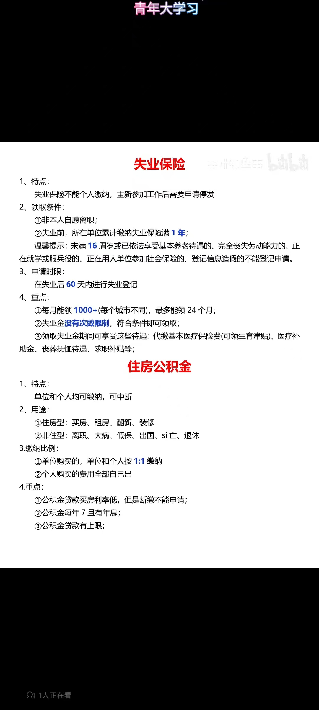

# consumption concept
1. 建立正确的消费观：简单生活哲学。金窝银窝不如自己的狗窝。
2. 行李箱，需要什么买什么。充裕不仅能让我们购买更多的商品，也会给予我们随意装箱的奢侈享受、不用动脑筋的奢侈享受以及犯了错误无所谓的奢侈享受。就像亨利·大卫·梭罗曾说过的那样：“一个人的富有程度，与他所能舍弃之物的数量成正比”。
3. 货比三家不吃亏，低价囤货半年用量。培养高品味，高低价单品混搭。我戴高仿手表并不掉价但我的笔芯不会低于8元一支。我们所谓的节俭根本派不上用场。我们会花好几个小时在网络上东查西找，就只是为了从一双标价为150美元的鞋子上省出50美元；但我们却不会为了从一辆价值两万美元的汽车上省出几百美元，而花费几个小时的时间去做信息搜集工作。发生购买行为时，节俭之人会思考的是，该商品的价格是否“优惠”。相比之下，穷人则会思考，为了付出相应的金钱他们要放弃什么。所以说，节俭之人并不需要进行真正的权衡，他们与所有生活在资源充裕条件下的人一样，很难体会到1元钱的真正意义。
4. 一般人的思考方式：只想找有稳定收入的工作，小钱掉了也不在意，有钱的时候先拿去付账单，总是不知道钱花到哪里去，因折扣而买易坏掉的东西。
5. 有钱人的存钱公式：开支＝收入-储蓄
6. 马斯洛需要层次理论
# 活得滋润的几大法则：
1. 拒绝消费
2. 拒绝生育
3. 娱乐虚拟化
4. 资产虚拟化
能告诉你的就这么些了，把钱花在和生存相关的事情上不要做不必要的浪费。人活着是为了什么？活着不就是为了死得慢点么？

人是会累的。不要高估了自己的体力，精力。
## 拒绝消费
尽可能放弃一切娱乐上的开销。

放弃物欲，重新定义自己的快乐。
## 娱乐虚拟化
我的娱乐就是做饭、看历史吧。花钱不多。

坏了，我现在也懒得做饭了。
## 资产虚拟化
先不要买房子，租房子没什么不好的。

时间管理还能应用在，洗衣服，做饭，办事，以及时间和金钱的平衡优化上。计算你自己时间和金钱的汇率，对比商品和服务的金钱和时间汇率。看看是自己花时间划算，还是用钱买划算。不要什么事情都自己做，也不要什么东西都用钱解决。
### 手机号更换计划
工作稳定后，换一个手机号，躲避原来手机号那么多推销。
### 付费软件
#### chatgpt
赖以生存的生产力软件。可以续着。
#### 百度网盘
可以续着，还挺良心的。
#### 京东会员
也可以续着。不需要考虑凑单问题。
#### 苹果
苹果专业软件的教育套餐，如果你是一个学生，或老师，或者为教育机构采购设备软件的人员，你可以用199美金的价格，买到苹果所有的专业级别软件，包括 final cut pro x 和 logic pro x，而且还有永久的免费升级，单买 logic pro x 就是 199美金，单买一个标准版的 fl studio 也是199美金adobe premier 年费要上千软妹币。
## 大house
我希望我家就像办公楼一样是大平层。安静温暖，阳光明媚。

考虑一下，地震、水灾的危害，最高不能高过12层。

安防足够好，绝无可能发生凶杀、火灾。现在选房子，第一考虑物业好不好，安不安全。只要保证了这点，女性完全可以一直自己生活。以后那种提供极度人性化、安全性的物业公司一定能大赚。

我讨厌任何稍有风险的环境、运动：高海拔、沙漠、风雪、暴雨。

一些案例：电热毯烧死一家三口。骑行五十公里导致睪丸坏死。倒车挤死老婆。
### 装修
浴室，上防滑的大理石。

装修整体风格，白色素静，简约淡雅。可以逛一下家博会。

断桥铝：双层中空钢化玻璃，静音效果好。

24小时的居民用电，自来水。用电安全，地线，漏保。这就意味着有24小时的热水供应，可以泡茶，可以做饭，可以洗澡。冷暖空调，不用穿太厚。电脑24小时运作。

位置一定要好，到工作地点、大型商超、小型生活超市、快递点、加油站等地有多远，各种快递、各种买菜软件能否上门。最好是在图书馆旁边。

5g信号足够好,好到如果流量够多，给电脑放热点；宽带足够快，穿墙能力足够好。

要两个卫生间，马桶和蹲便。

洗衣机、烘干机，放在阳台旁边。

天纬陶瓷，通体陶瓷，不会吸水变臭。地板没封。

领普人体传感器。

电源总控，要分得细一点，各个房间能单独断电，用滑动木板放在门口，木板背后放灯带。

走廊脚边要有灯带。

买小米智能全家居、辅以宜家家具。智能化厨房。

家具：饭桌，椅子，电脑桌，床，衣柜衣架。垃圾桶。

窗帘的遮光性，建材的隔音效果，隔音窗。

床头、门口都能关灯，串联。

租房旁边一定要有，山姆这种大型平价商超。

联合利华、宝洁。牙膏用老牌的最便宜的，因为关键在于刷牙，牙膏只是摩擦剂。

以后买别墅的话，要有电梯。
## 家用轿车
无脑比亚迪。车机导航要足够好用。如果是武汉，比亚迪汉的空间、续航，都够了。

小米su7 很不错，干脆从车子到家居，都用小米。

迁就的次序一定想清楚。因为房子有充电桩，才买电车。租房也要有充电状。

汽车安全锤

12122 高速拖车免费

房子还要有消防设施，比亚迪可以在停电时候，给家里反向供电。整个房车，电磁炉还能炒菜。但是换电池可贵了，研究一下能不能免费换电。

明明有地铁这样纳税人“亏钱维护的交通设施，明明有网约车这样随叫随到的短途服务。
买车的成本和收益“，怎么算都是亏的。
买车唯一的作用就是泡妞的时候显摆，现在你男朋友已经泡到了。如果我是你男友，我即使有车都会直接把车卖了，银行吃利息，20万一年吃利息就能吃4000。4000块钱，你算50块一次网约车。能够你打80次，平均一个月可以打6次车。
另外车的话还有保养费，电费，保险费“，停车费，交通违章“等等隐藏费用。这就是为什么你能看到很多人在面对大萧条“的时候可以从容不迫，而你由于害怕公司裁员，周末还要加班996的原因。
如果不是靠银行利息“就能买车，我觉得完全没必要。贷款买奢侈品相当于借钱去亏，长期下来肯定很难攒下储药。
## 衣服
我买了一套海澜之家的西服：

不可水洗，不可漂白，不可翻转干燥，熨斗底板最高温度150°C, 使用四氯乙烯和符号F代表的所有溶剂的专业干洗，常规干洗.

有空开车去胖东来，给家人买一身。
### 眼镜
去丹阳，或者去医院测验光单。

## 小院子
可以种菜，养花

吃烧烤，买点山姆预制羊肉串就挺好的。武汉有三家山姆。
## 常用家居
### 灯具
倒是不用特别花哨，实用、贴心、耐用，就行了。
### 椅子
不要买空心钢管制作的椅子。
### 门
大门外装摄像头，摆个快递架子。

我觉得物理锁就够了，没必要搞什么智能锁。
### 厨房
1. 胖东来天使城、时代广场，九鼎铸匠原生铁锅抖音官店。
2. 九牧水龙头，开关都有阻尼感。
### 空调
要根据房屋面积来选择。

对于房屋暖气的考虑，如果一年几千块取暖费，空调电费也不见得有这么贵。

新风系统，vaillant

风管机

小米也用中央空调了，不清楚售后服务怎么样。
### 电脑
猫到路由器，路由器到交换机，交换机到各个房间。

显示器一定要大，27寸4k，或者32寸4k。（适配mac，可以作为考虑条件之一）

要根据自己的工作性质，选择电脑。还是考虑苹果笔记本+Windows电脑的组合比较好。
有电脑还需要电视吗：apple tv, ps5, xss, switch。

显示器能不能当电视？

powertoys可以实现屏幕自定义多分屏。

笔记本便携方便，都是放屁。工作之外，不碰电脑。

家用显示器要安装一个支架，机械，可以随意调整方向，高度，角度。那就可以适配不同用户的身高体态。
#### 我买台式机了
平板加台式机的组合已经非常够用了。以后可以充分探索三星平板的功能。

当然，最重要的是，要想明白，要干什么事情。比如看书，用什么介质都行。
### 电视
如果依然要买电视
可以买个小米，比较大的75寸，85寸那种。背后安装支架，感觉有点多此一举了。
### glados
github 搜 glados_checkin
### 手机
考上公务员的话，还是有必要买个苹果手机。安卓是工作，苹果是生活。主要是安全。
### 安卓平板
【插存储卡的三星平板／手机如何将应用程序转移到外置存储卡？】 https://www.bilibili.com/video/BV1gv4y1R77n/?share_source=copy_web&vd_source=718bc38f0f2bced4f5d80daf4f7d7220

以后有空，一定要找一个能跳过开屏广告的软件。

已经移动到sd卡的APP：
58同城
adskipper
Alipay
Amap
APKPure
Assistant
Authenticator
Baidu Translate
Bigverse
bilibili 竖版
bilibili 横版
BOSS直聘
calculator
CamScanner
Cityc Bank
CoolApk
Copilot
Coremail Lunkr，只能登录上科大邮箱。
CSDN
DeepL
DingDing
Discord
e-CNY
ele.me
Feishu
Github
IELTS Pratice
IELTS practice band 9
LeetCode 
Line 
maimai 
Microsoft 365
Nutstore
offershow
outlook 
ovitalmap 
PayPal 
qq
quizlet
railway 12306
reddit
scanscan
speedtest
Spotify
SuperDisplay
Tencent Meeting
TMall
ToDesk
Translate
UnionPay
U净
VSCO
WeChat
Weibo
WPS Office
X
Youtube
Yuque
uTorrent
上海交通卡
上海银行
个人所得税
中国工商银行
中国建设银行
中国移动
中国联通
中国银行
中羽在线
买单吧
交管12123
交通银行
京东
全国12315平台
全民生活
公考雷达
力扣 LeetCode
唯品会
国家医保服务平台
国家反诈中心
大麦
天天基金
天猫精灵
天眼查
央视频
夸克
学习强国
安居客
小红书
工银e生活
建行生活
得物
微信读书
抖音
招商银行
拼多多
掌证宝
智联招聘
智行火车票
智谱清言
民生银行
浦发银行
牛客
百度网盘
百度贴吧
美团外卖
腾讯自选股
菜鸟
迅雷
邮储银行
阳光惠生活
阿里云盘
雅思考满分
雪球
青藤之恋
飞猪旅行
国聘
猎聘
应届生求职
中国结算
阿里巴巴
闲鱼
同花顺
慢慢买
kimi
## insurance
保险是必需品。赚不了更多也就算了，赔进去就真的完蛋了。

我是b型血；没事不要献血。

保持自律的生活，不熬夜。前提就是你要把你的效率提高，在有限的时间内把事情做完，用早起的时间。饮食结构比较符合中国营养膳食指南中所说的那种蔬菜。运动。心态要好。

身体是革命的本钱：每年定期体检。给家人买保险。
# 金融常识
穷人思维的本质：专精技术

富人思维的本质：现金流管理+时间管理+少量通识技术

你并不需要背古诗，学文言文，学习解析几何，做大量数学，背诵大量英语单词。只要基本掌握数学，中文，英文就完全足够了。超出你能力的部分，你可以用搜索引擎，翻译，或者是购买服务获得。如果你花时间调查，那么基本上是能用合理的价钱得到服务的。
## 缴税问题
赡养老人，租房，技能证书都可以所得税减免。人社部有证书的清单。跟职称有关的证书考证费用可以抵税。

### 五险一金

## 家庭现金流管理
如何合法地用最少的钱得到最优质的资产/产品（捡便宜货），以及如何把最垃圾的资产/产品卖出最高的价钱（收智商税）

捡便宜货（广义）

很多人平时省吃兼用，努力工作，一到买房，买股票就很快决定了。却不知道大额交易应该付出比平时百倍，千倍的时间去收集资料和思考。买房，买股票才是真正应该“讨价还价”的地方。一套一千万的房子，如果你能用95折买到，那么你就省了50万，你要多精打细算，才能在拼多多上省下这么多钱啊！

股票基金也是如此，如果一个股票和基金被低估，那么这个时候就和打折是一个道理，你如果愿意去买打折商品，就应该去买打折的股票。当然资本家会把金融设计得非常复杂，所以你需要花点时间去研究，研究难度肯定是远远小于考个985的。

房产也是一样，制度会被设计得非常复杂，所以你需要了解城市规划，未来是不是要通高速，铁路。在这些基建项目正在建设，还没建成的时候低价买入，坐等基建完善之后增值。你还要了解开发商靠不靠谱，基建会不会烂尾等等。

收智商税（广义）
如果你还是用打工赚钱的想法，那么随着国家印钞，通货膨胀，你的现金会一直缩水，你需要拼了命的努力工作才能维持生活水平不下降，而一旦失去工作，或者子女一个不小心考不上好大学，整个家庭就此滑落。你需要教你的孩子如何在法律允许范围内，把低价值的东西卖出高价。房子，股票，债券，基金等资产都是这个道理。
## 少量通识技术
智商税来源于信息差，通常来说，智商税收官为了降低搜寻成本都会用骗傻子的方法收税。不然如果骗到懂行的专家，浪费时间还没收到税，那就亏大了。

你只要学过基本的金融知识，简单资产组合理论，就能有效的对银行理财推荐的内容有个大致判断，对方收取的管理费是不是太高了。只要你学过基础的金融，不难看出银行的基金经理本质就是个销售。

IqoOLKs">当然你需要教孩子的不只是金融，还有法律，医学，计算机，制造，服务等一些方面的通识教育。你不用亲自去购买资产，不用亲自打官司，亲自去开药，亲自去写代码，但至少要知道这些东西到底是怎么做的。

只要入门，站在一些真专家的肩膀上，就可以有效的避免大部分智商税。当然互联网上热爱分享真理的人还是少数，所以更要对这些人加以鼓励。
## 最后推荐大家两个关于富豪生活的纪录片系列
亿万富翁们的饕餮盛宴​www.bilibili.com/bangumi/media/md20611/?from=search&seid=15880131232896155153

枯燥的富豪世界：Born Rich + The One Percent

电影的导演是：Jamie Johnson，强生公司联合创始人的曾孙，展现全球财富排名前1%家庭的真实生活。

Born rich documentary, - YouTube​www.youtube.com/watch?v=1sD3pG74Wv8
https://www.youtube.com/watch?v=HmlX3fLQrEc​www.youtube.com/watch?v=HmlX3fLQrEc

他们的财富每年以30%的速度增长，而他们不需要为钱和工作而发愁，可以尽情的追求自己的爱好，全身心的投入到自己所爱的事业上。

世界上有不少资本主义的叛徒，大量透露了资本和财富的秘密，随着互联网的发展，就连我们这样的普通人也能免费获得。只可惜这个世界的大多数人被自己的意识形态所禁锢，跳出不思维的牢笼，不能正确分辨对错。终其一生都在漫长的痛苦和焦虑中度过，纵使偶然获得财富，也寝食难安。

我们普通人可能这辈子也获得不了那样的财富，不过只要掌握资本规律，省钱，投资。可以不用通过强迫孩子学习的方式来担保孩子的未来。而是教育孩子如何省钱，如何投资，如何思考，以及如何享受人生。

财富自由是有个门槛的，在中国最低门槛大概是1千万。抛开住房，你的家庭要有一千万以上的存款。没钱还想要自由，那么只能降低欲望，只为基本的食物花钱，用最低碳环保的方式来度过这一生。

对小镇做题家的建议：脚踏实地996，省吃俭用攒人脉，剩下1天搞理财。

家底不厚的，你大概率是要去大厂996的。升到管理层，创业融资，IPO上市是你为数不多的几种选择。而在你财富自由之前，你学的金融知识就对找工作没有任何帮助，不仅没用，要是你老板知道你不是专心搞技术还觉得你做事不靠谱。

金融发挥作用，也是你有大量闲置资金，或者你能借到大量低息，长期资金的时候才起作用。